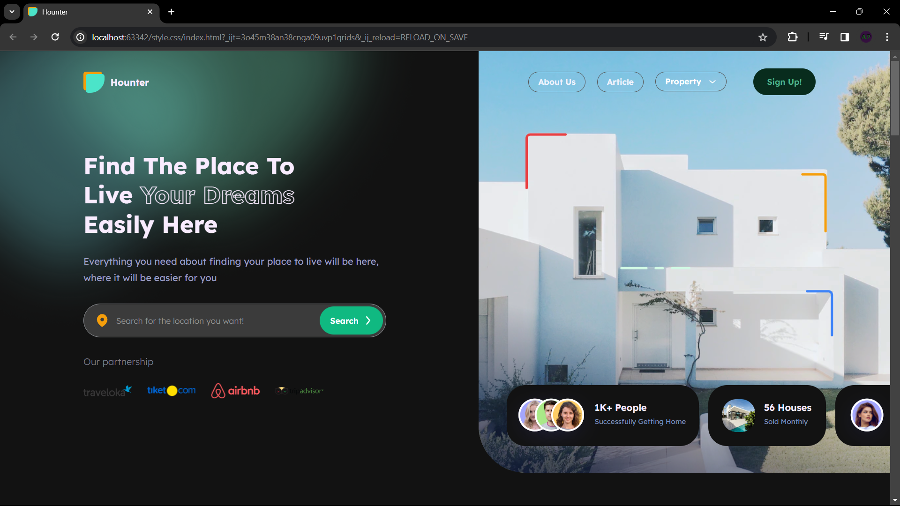
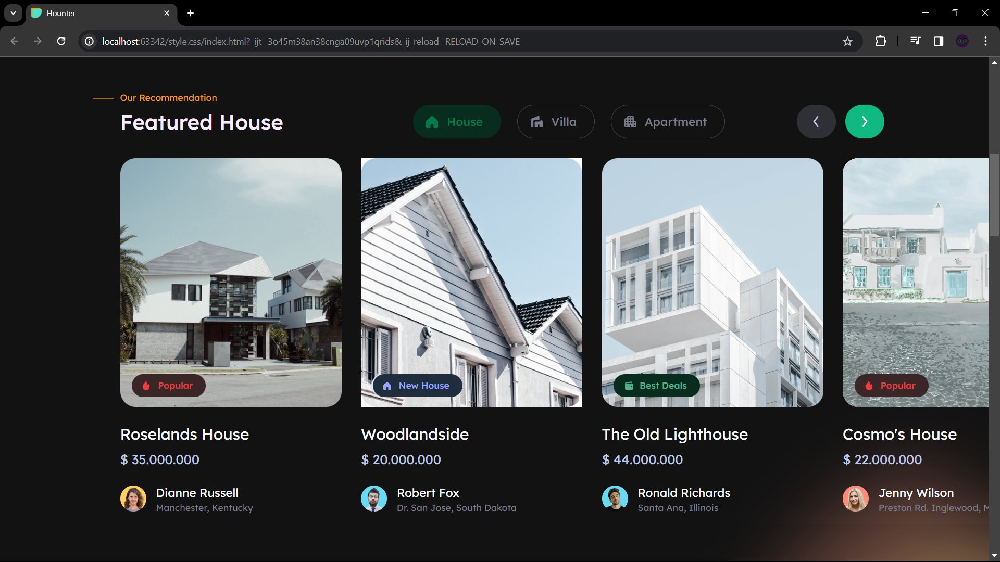
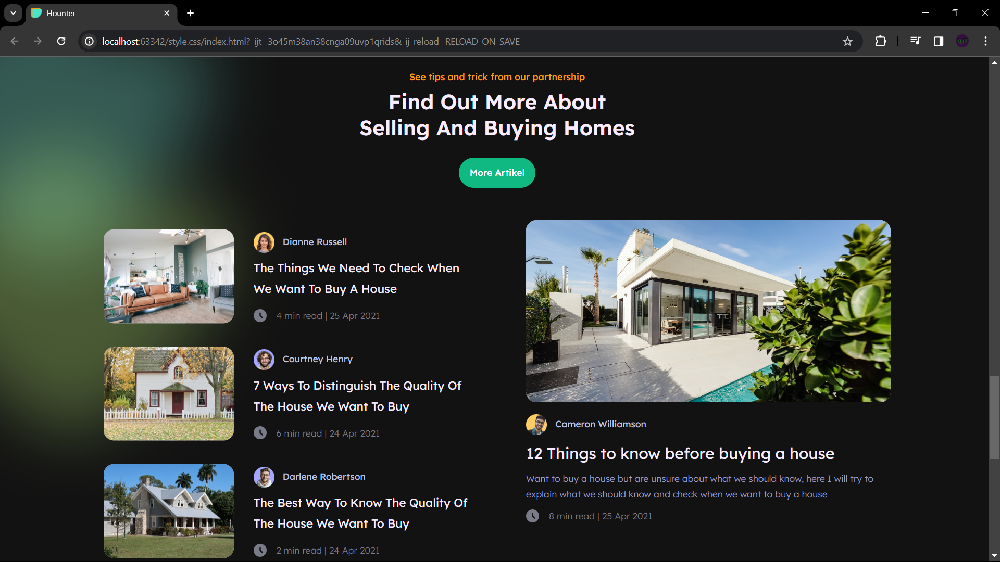

# web-hw

## Homework 1, 2, 3

Link to the first homework in [Whimsical](https://whimsical.com/web-hw-XdpUJmUwbQffuPKGLJzYSw)

The correctness of the layout was tested on three browsers: Firefox, Chrome and Microsoft Edge. On all these browsers, it showed a good result at different screen widths(1200-1920px).

Some buttons with links are interactive and clicking on them will either return to the beginning of this page, if it should have some internal functionality, or to relevant sites, such as social networks.

Also, if the user has a strict dark mode for sites, then it is well supported, with several defects.

